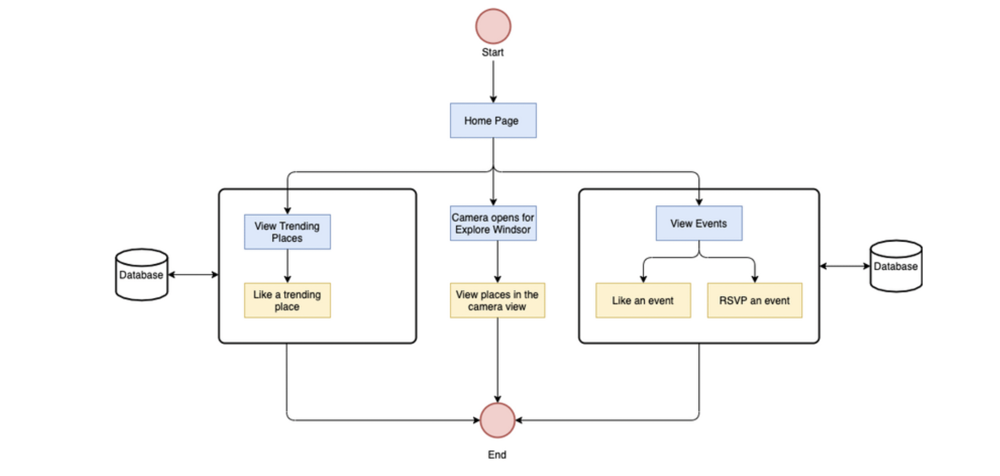
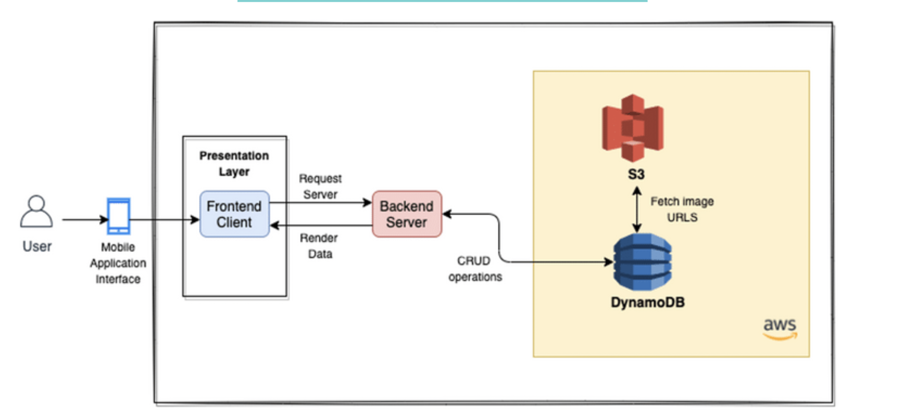

# Advanced Software Engineering Project
# Traverse Windsor - Mobile Native Application | Augmented Reality

## Introduction
Traverse Windsor is a cross-platform mobile application which uses Augmented Reality allowing users to locate the nearby places in the view of their mobiles' cameras. The application is a one-stop-shop for all the happenings in Windsor and what places are trending at the moment. The users can also add any public events for all the residents and tourists. The users can view these events and either like or RSVP to any particular event.

### Features Used
The functional features of the application are as follows:
- Explore Windsor
- Trending Places 
- Events

### Project Flowchart



### Technology Stack


### Solution Architecture



### Prerequisites


- [Visual Studio Code](https://code.visualstudio.com/)
- [Git](https://git-scm.com/downloads)
- [Android Studio](https://developer.android.com/studio)
- [React Native CLI](https://reactnative.dev/docs/environment-setup)
- [Amazon Web Services](https://docs.aws.amazon.com/cli/latest/userguide/cli-configure-quickstart.html)
- [Viro React CLI](https://docs.viromedia.com/docs/quick-start)


### Installing

The steps are:
 1. [Setting up Visual Studio Code](#step-1---setting-up-visual-code-studio)
 2. [Cloning the Application](#step-2---cloning-the-application)
 3. [Installing necessary Javascript Libraries](#step-3---installing-necessary-Javascript-Libraries)
 4. [Setting up the AWS Enironment](#step-4---setting-up-the-aws-environment)
 5. [Setting up Viro React CLI for Augmented Reality](#step-5---setting-up-viro-react-cli-for-augmented-reality)
 6. [Additional Setup](#step-6---additional-setup)
 7. [Running the Application](#step-7---running-the-application)


### Step 1 - Setting up Visual Code Environment

- Install the Visual Studio Code IDE for the respective OS, launch the IDE.
- Open a terminal in the studio to excute commands.

### Step 2 - Cloning the Application

- Extract project .zip file from the Github Repository or
- In the terminal type the following command

```
$ git clone https://github.com/AnishaGharat/Traverse-Windsor 
```

This command will pull the latest project files from git repository.

### Step 3 - Installing necessary Javascript Libraries 


- Navigate to the cloned project folder on Github.

- From the prerequisites link for React Native CLI, navigate to the React Native CLI Quickstart.

- Select the Development OS and the Target OS to get all the commands for installation of the CLI on your respective OS.

### Step 4 - Setting up the AWS Environment 

- Using the terminal configure the AWS CLI as per the Development system OS.

```
$ aws configure
```
- The user would need to add his AWS Access Key ID and AWS Secret Access Key to configure the AWS CLI on their OS.

- Note: The Access Key and Secret Key are not present in the Github Repository for security reasons.

- Install the AWS Node SDK on the terminal

```
$ npm install aws-sdk
```

### Step 5 - Setting up Viro React CLI for Augmented Reality

- Set up the Viro React library for the Augmented Reality Feature for the application by using the prereqisite link for Viro React CLI.

### Step 6 - Additional Setup

- The application requires a Google Maps Places API key: Get this from the Google Cloud Platform (Even if it is a paid API, Google gives $300 credits).

- After getting the key, set it on the API_KEY constant on Camera.js line 28.

### Step 7 - Running the Application

- Before executing the application, it is best to run the following command to remove any dependancies related issues:

```
$ npm install
```
- Enable the USB Debugging for Android.

- Android Device > System Settings > Developer options > USB debugging.

- Switch the USB Debugging on.

- Android Device > System Settings > Developer options > Wireless ADB debugging.

- Switch the Wireless ADB debugging on.

- Connect the Android Device to the laptop.

- Once connected run the following command to check if the device is active.

```
$ adb devices
```
- This will display the name of your Android device and confirm that it is active.

- Run the server and the client using two different terminals.

- Run the server:
    - Navigate to the server folder

    ```
    $ cd server
    ``` 
    - Run the following two commands to run the server

    ```
    $ npm install express
    ``` 
    ```
    $ npm start
    ``` 
- Run the client:
    - Navigate to the client folder

    ```
    $ cd client
    ``` 
    - Run the following command to run the client

    ```
    $ npx react-native run-android
    ``` 
    
## Versioning

We use [GitHub](http://github.com/) for versioning. 

## Final Presentation

The final presentation for the release 1.0 can be viewed [here](https://www.canva.com/design/DAEmgTX0Vxc/dK4ouAphlPVlzorqX5hgWA/view?utm_content=DAEmgTX0Vxc&utm_campaign=designshare&utm_medium=link&utm_source=sharebutton#1).

Note: Access Limited

## Authors

* **Adhiraj Singh**
* **Anisha Gharat**
* **Sarwat Til Vusqa**
* **Ravleen Kaur**
* **Shoaib Ahmed**
* **Rizvi Ahmed**
* **Vishal Solanki**
* **Purvesh Patel**


